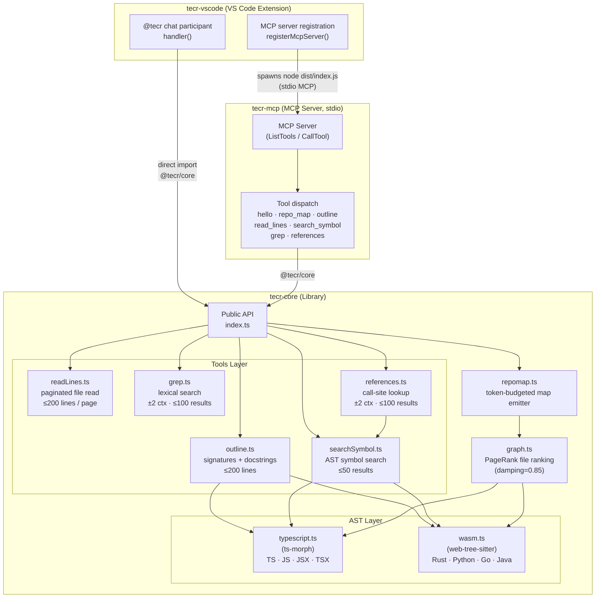
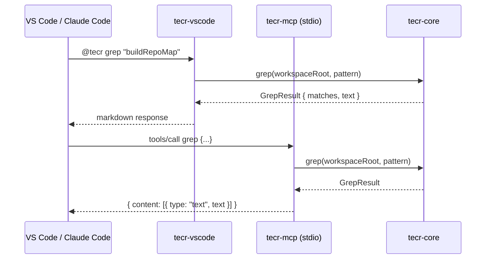

# TECR Architecture

High-level overview of the three-package monorepo and the data flows between them.

## Package Diagram

## Data Flow: Tool Call

## Layer Responsibilities

| Layer | Package | Responsibility |
|---|---|---|
| VS Code Extension | `tecr-vscode` | Chat participant UI, `@tecr` commands, MCP server registration for compliant hosts |
| MCP Server | `tecr-mcp` | stdio JSON-RPC server, tool schema declarations, thin dispatch to core |
| Public API | `tecr-core/index.ts` | Stable contract; lazy-import wrappers so tree-shaking works |
| AST Layer | `tecr-core/ast/` | Language-specific symbol + import extraction (ts-morph for TS/JS, web-tree-sitter WASM for Rust/Python/Go/Java) |
| Tools Layer | `tecr-core/tools/` | Stateless functions over the filesystem and AST results |
| Graph | `tecr-core/graph.ts` | PageRank-based file importance ranking from import graph |
| Repo-map | `tecr-core/repomap.ts` | Token-budgeted, ranked symbol emitter |

## Exclusion Rules (§6.3)

All file-walking tools skip: `node_modules`, `dist`, `build`, `.git`, `out`, `coverage`, `target`, `__pycache__`, `.venv`, `venv`, `vendor`. Binary files (null bytes in first 8 KB) and `.d.ts` declaration files are also skipped.
